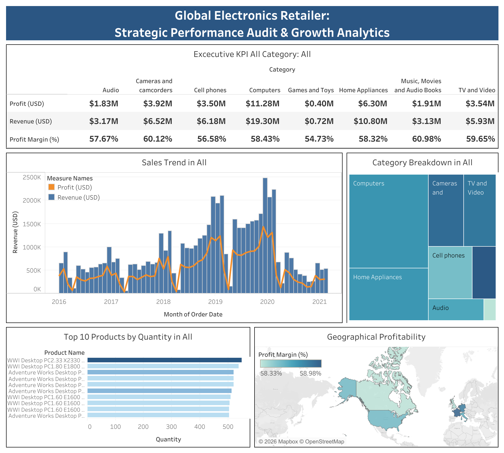

# Global Electronics Retailer: Strategic Performance Audit & Growth Analytics

## 📌 Project Overview

This project delivers a comprehensive **strategic performance audit** and **growth analytics** for a global electronics retailer. By integrating multiple datasets (Customers, Products, Sales, Stores, and Exchange Rates), I developed an executive-level dashboard in Tableau Public to analyze revenue performance, profitability by category, product performance, and geographical trends.

The primary goal is to identify high-performing categories, top-selling products, and key growth opportunities to support data-driven strategic decisions.

## 🗂️ Data
The dataset was obtained from Maven Analytics: [Global Electronics Retailer](https://mavenanalytics.io/data-playground/global-electronics-retailer)

The analysis was performed using **five interconnected CSV datasets**:
- `Sales.csv` – Transaction-level sales data
- `Products.csv` – Product details and categories
- `Customers.csv` – Customer demographic information
- `Stores.csv` – Store location data
- `Exchange_Rates.csv` – Currency exchange rates for global standardization

All datasets were joined within Tableau Public for seamless multi-table analysis.

## 🛠️ Tech Stack

* **Data Preparation:** Data blending & relationship modeling in Tableau
* **Visualization & Dashboard:** Tableau Public
* **Analysis:** KPI development, trend analysis, and geographical mapping

## 🔍 Key Business Insights

* **Category Performance:** **Computers** is the top-performing category with **$19.30M** in revenue and **$11.28M** in profit — significantly outperforming all other categories.
* **Profitability:** The business maintains exceptionally strong profit margins, ranging from **54.73%** to **60.98%** across all categories.
* **Product Leadership:** Desktop PCs (particularly Adventure Works and WWI models) dominate sales volume, with the top product exceeding 500 units sold.
* **Geographical Strength:** North America and select European markets show the highest profitability and revenue contribution.

## 📊 Dashboard Preview

> **Interactive Version:** [View the Live Tableau Dashboard Here](https://public.tableau.com/views/GlobalElectronicsRetailer_17696262976770/GlobalElectronicsRetailerDashboard?:language=en-US&:sid=&:redirect=auth&:display_count=n&:origin=viz_share_link)

---

👨‍💻 Created by: **David Sebastian Aritonang**  
📧 Email: [davidsebastianartt@gmail.com](mailto:davidsebastianartt@gmail.com)  
🔗 LinkedIn: [linkedin.com/in/david-sartt](https://www.linkedin.com/in/david-sartt/)  
